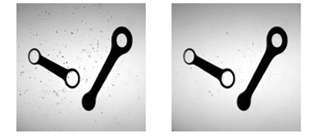
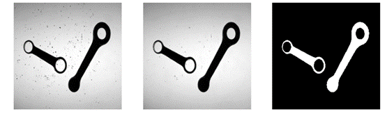
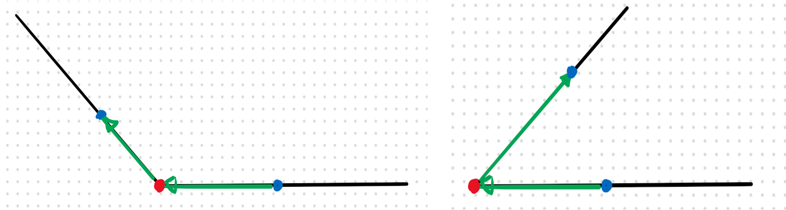
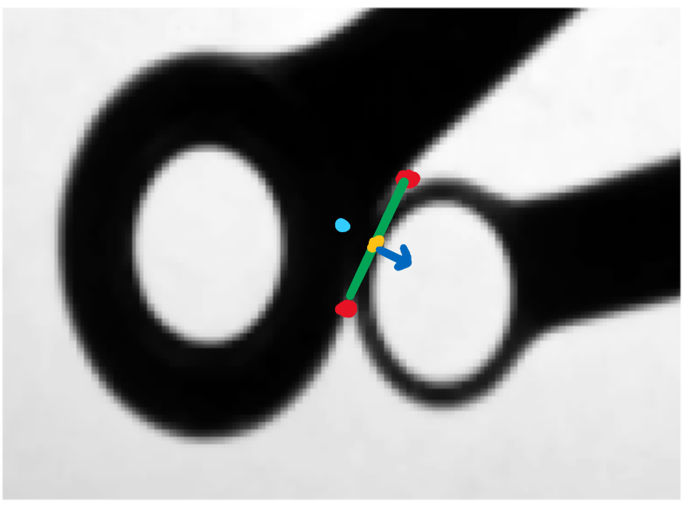
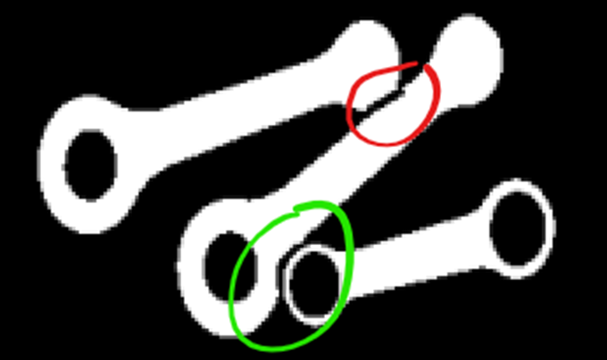
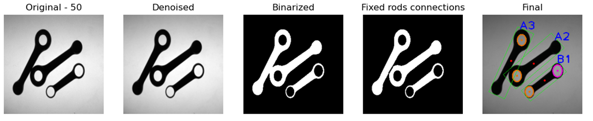
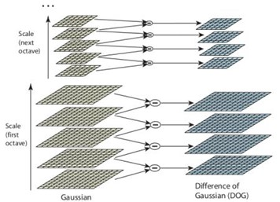
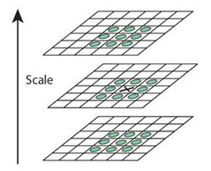

# Computer Vision Projects

## Visual Inspection of Motorcycle Connecting Rods

### 1. Requirements
The project requires to develop a software system aimed at visual inspection of motorcycle connecting rods.

There are two main tasks:
1. For each rod, the program should calculate: the type of the rod (A if it contains one hole, B if two), position, orientation (modulo π), length (L), width (W), width at barycenter (WB) and for each hole, position of the centre and diameter size.
2. The software should be robust enough to deal with noise due to scattered iron powder, with contacts between rods and with the presence of distractor objects that must be ignored.

### 2. Project structure
The project consists of:
- `rods.py` – contains the software logic.
- `asset/rods/` – contains all the images to work on.

#### 2.1. Features and interaction
The software loops through all the available images, grouped by their corresponding project task, showing, for every image, each step of the inspection process.

Closing all the opened windows triggers the calculation of the next set of images until the program ends.

All the images are arranged on multiple rows and on multiple windows when the space is not sufficient.

The informations required to complete the project are printed, for each rod, on the terminal (stdout) before the figures appear.

### 3. Development
To be the more general as possible, the software analyses every image through the same sequence of steps, adapting some calculations as issues like distractors or contacts appear.

#### 3.1. Denoising
When considering real world images, one should often deal with noise.

In the project it could happen that in some images there could be some iron powder. Looking at the provided testing images, it was noticed that it could appear as small isolated black points behaving as impulse noise.

Filters like the mean or the Gaussian cannot be effective because they spread the noise error over its neighbourhood. The filter chosen is the median one because it is very effective at counteracting impulse noise. The kernel size is 3 because it reduces the noise without blurring the image too much.

Sometimes the powder is grouped so to create small conglomerates. In that case the median filter is ineffective, but the issue is dealt during the rod recognition.



_Figure 1 - Denoising example. Original image on the left and the denoised on the right._

#### 3.2. Binarization
All the photos are taken using a method called backlighting meaning that they receive illumination from the back so to distinguish all the objects from the background.

To recognize regular shapes and contours in an image, it is useful to clearly separate the pixels associated to the objects in our scene from the pixels related to the background. This process is called binarization and it is commonly done through a threshold which is practically the separator between the two categories.

Applied to a gray-scale histogram, a threshold is used to apply the same intensity value to all the underlying  intensities (e.g. 0) and another opposite value (e.g. 255) to those overlying it so to obtain, from a gray-scale, a black and white image.

This process must be flexible enough to deal with different lighting conditions and for that reason the choice of the correct threshold is not obvious and should be calculated automatically depending on the image features.

The Otsu’s algorithm is very useful in that context because it allows to quickly and automatically calculate an optimal threshold.

I chose to use it through the OpenCV’s thresholding function called `cv2.threshold()` with the Otsu’s flag enabled.

```python
cv2.threshold(filtered , 0, 255, cv2.THRESH_BINARY_INV + cv2.THRESH_OTSU
```
 
The choice of the binary inverted threshold is due to the fact that the next step, the contours detection, works in OpenCV finding white objects from black background and not the opposite.



_Figure 2 - Original image at left. Denoised at centre and binarized on the right._

#### 3.3. Finding rods
The binarization process ends up with background and foreground pixels without any information related to the macro-structures that define our objects. All the calculations needed for this task have been inserted in the function `evaluate_blobs()`.

To recognize a rod, it was chosen to rely on two simple considerations: every rod has at least one hole and it has an elongated shape.

To be robust, the identification process is based on multiple steps through which I first exclude distractors and then I separate touching rods.

As the first step, it was chosen to use the built-in OpenCV function `findContours()` which returns 3 elements: an image mask, a contours array and a hierarchy array.

The hierarchy parameter is very important because it allows to search for nested contours that in our case are the internal holes.

There could be different ways to specify hierarchies to OpenCV depending on the relationship between parents and children. It was chosen to use as a Contour Retrieval Mode the cv2.RET_TREE because it retrieves all the contours and creates a full family hierarchy list.

Every contour has its own information about the hierarchy and for that reason OpenCV represents it as an array of four values: next, previous, first child and parent.

After the contour retrieval, I loop through all the hierarchy structure so to find rods in a few steps.

In the first one, I exclude distractors such as screws that does not have any internal hole.

```python
if hierarchy[0][i][PARENT] == -1 and hierarchy[0][i][F_CHILD] != -1:
```
 
Then I want to calculate the elongatedness of the object so to exclude all the other distractors. To do this I first calculate the minimum (oriented) enclosing rectangle (MER) through the OpenCV function `minAreaRect()` and then I calculate `E=length/width>1.5` where 0.5 is a threshold to distinguish between circular distractors and rods.

The next step is to deal with possible connections between rods. If connected, two rods appear as one single object with a very large contour. I looked to testing images so to find a threshold to distinguish between the two cases. After some experimentation I found that a value of 450 is bigger enough from the maximum size of a single rod and smaller enough than the minimum of two connected rods.

In case of connections, the software looks for convexity defects of the whole structure. Because of possible imperfections, it obtains not only the desired connection points but also false positives. Some of them are on the curvatures of the rods and they are very close together while other are alone on the straight connections between the two rod’s extrema. In the first case, subsequent points are pruned if they are closer than a chosen fixed threshold, while in the second case, the alone points are pruned if they are farther than the same fixed threshold.

All the remained points have to be validated if they are related to contacts between rods. This final control is done looking at vectors starting at the each one of these points and directed to a previous and a successive point given by a fixed shift. If the vectors coordinates have opposite directions, one positive and the other negative, that means that the considered one is a contact point.



_Figure 3 - Example of evaluation of connection points (red). On the left the point is pruned while on the right it is considered as a contact point._

After the search for connecting points made by the `find_rods_connections()`, a fix to separate the blobs is needed. It has been noticed that for every contact there are a couple of points, one near the other. So, to find the couples it is sufficient to check their distance.

To fix the binarized mask, it is not robust to simply draw a straight line because it could remove significant parts of one of the two connected blobs. To detect this case, the software moves from the middle of the straight line connecting the two contact points and if a background pixel is found, before a given threshold, it means that one of the two rods has a very small border and drawing a straight line could cancel part of that border causing detection issues. So, in that case at the opposite side of the connecting line I insert a new point that acts as a control point of a Bezier curve so to better approximate the rods curvatures.



_Figure 5 - Example of connections that needs an approximation of the curvature. Red points are detected as convexity defects. The yellow is the middle point. The blue vector shows the direction of the border's check. The light blue point corresponds to the added Bezier control point._



_Figure 4 - Result of the fix. A straight-line fix on the top (red) and a Bezier fix on the bottom (green)._

#### 3.4. Rods features
After the rods’ recognition, I could categorize them and search for their features.

Given the contours hierarchy, the type identification of each rod is straightforward because it is sufficient to check if at the level next to the root there is only one or two children. In each case the centre’s position and the diameter size are returned by the `fitEllipse()` function.

The detection of the barycenter is based on a scanline algorithm which scans the blob in a top-down left-right order. Then the barycenter is obtained from the following equations:

`x_b=(1/A)∑x`

`y_b=(1/A)∑y`

The rod orientation is found as the angle between the horizontal axis and the normalized line connecting the barycenter to the centre of the first hole. The calculation is done through the `math.atan2()` function that returns the angle in radians between -π and π and it can compute the correct quadrant for the angle.

As for the orientation, to calculate the width at the barycenter the software finds the perpendicular line to the major axis as the cross product between the normalized line connecting the barycenter to the centre of the first hole and the unit vector along the z-axis (ideally exiting from the display). Then, using a linear interpolation, it checks for all the pixels through which the perpendicular line passes until a background pixel is found. The result is given by the difference between the barycenter and the edge point and then it is doubled to match both sides with respect to the barycenter.

Position, length and width are provided by the initially found MER.



_Figure 6 - All the steps described toghether with the final result._

----

## Development of an Augmented Reality System

### 1. Requirements
The project requires to develop a software system aimed at creating an Augmented Reality (AR) video starting from a given one.

### 2. Project structure
The project consists of:
- `ar.py` – contains the software logic.
- `asset/ar/` – contains all the sources to work on and the result.

#### 2.1. Features and interaction
The software applies a label to each frame of the input video according to the Frame to Reference (F2R) approach.

The output is saved in the folder where sources are.

During the rendering the progress is showed on the terminal (`stdout`) window.

### 3. Development
The application of a label on a surface, like the book provided for the project, requires some steps in order to recognize the features of the book for each frame and then apply some transformations to the label so it could appear as glued on the surface.

The first thing I do is to exclude all the uninteresting pixels from the reference image through a mask. I do the same for the label layer with the only difference that I apply a crop since the image size contains lots of unused blank pixels that does not fit well on the book’s surface.

#### 3.1. Scale-Invariant Features Transform (SIFT)
The first phase we dive in is usually called keypoint detection and it refers in finding salient features in the image under analysis that could be associated to the object in the reference image.

The process should be robust enough to deal with different transformations that could happen in multiple views of the same scene such as translation, rotation, scaling and intensity changes. Some methods have been proposed, like the Harris’ one, but it is not scale invariant. For that reason, SIFT was proposed and it is the method chosen for that project.

To analyse the image at multiple scales we need to refer to scale-space filtering. The key idea is to use a Gaussian filter with a larger and larger kernel so to highlight, at different steps, the main structures of the scene. From theory, Laplacian of Gaussian (LoG) is used with a growing σ that acts as the scaling parameter. Practically LoG involves heavy calculations and for that reason, SIFT uses the Difference of Gaussian (DoG).

To obtain a DoG it is needed to compute different octaves in which an image is successively blurred by a Gaussian filter with a σ increased by the parameter `k=2^(1/s)`, where s is the number of intervals in the octave. As the name suggests, the DoG is found as the difference between subsequent blurred images in the octave.



_Figure 1 - Representation of the DoG process._

Once the DoG have been found, the algorithm goes through extrema detection which consists in finding candidate keypoints in scale (through the DoGs) and space (through the considered DoG). So, that point (x,y,σ) is compared with its the 26 neighbours as showed in the Figure-2.



_Figure 2 - A pixel (the cross in the middle) is compared with its neighbours._

To better localize keypoints, the DoG function can be approximated by the Taylor expansion. Because of low contrast, the new extremum calculated is unstable and then it is pruned if its intensity is less than a threshold.

Also, the keypoints related to edges need to be pruned. The DoG in that case has a high response so the operation is based on the eigenvalues of a Hessian matrix, which are proportional to the principal curvature. From the Harris corner detector, we know that when we encounter an edge, one of the eigenvalues is larger than the other. So, if their ratio is greater than a threshold, the considered keypoint is pruned.

The next step is to assign an orientation to each keypoint in order to achieve invariance to image rotation. Firstly, for each keypoint is calculated the magnitude and the orientation of the gradient related to the blurred image. Then an orientation histogram, made of bins, is created by accumulating the contributions of the keypoint’s neighbour pixels. Each contribution to its designated bin is given by the gradient magnitude weighted by a Gaussian with σ=1.5 times the scale of the keypoint. The highest peak in the histogram gives the keypoint’s canonical orientation. Other peaks, above 80% of the main one, are also considered in calculating the orientation. This process contributes to the stability of the matching phase.

The next phase is about creating keypoint descriptors. Given the detected keypoint (x,y,σ), a 16x16 neighbourhood is taken in the associated Gaussian-blurred image. It is then divided in 16 sub-blocks of 4x4 size and a gradient orientation histogram is created for each region (with gradients rotated according to the canonical orientation previously found). A total of 128 bin floats are available. It is robust against several issues present in our input video, such as rotation and lighting changes.

All these passages have been explained to better understand the complexity that OpenCV summarizes in a few functions.

```python
sift = cv2.xfeatures2d.SIFT_create() # sift detector initialization

# keypoints SIFT detection on reference object and current frame
kp_ref   = sift.detect(reference)
kp_frame = sift.detect(frame)

# compute SIFT descriptors
kp_ref, des_ref     = sift.compute(reference, kp_ref)
kp_frame, des_frame = sift.compute(frame, kp_frame)

```
 
#### 3.2. Features matching
After the extraction of keypoints and their descriptors, it is needed to match them between different views that are, in our case, the current frame and the reference image.

The matching phase between different views of the same scene falls into a Nearest Neighbour (NN) problem and depending on the algorithm, the Euclidean distance function or the Hamming’s one can be used.

Searching for a NN of the query feature can be slow and for that reason it needs an indexing technique, such as the k-d tree, to speed up the process.

The k-d tree splits the whole space of the data into “bins”. During the search, the query point traverses the tree from the root down to a leaf, according to the splits defined by the nodes. During backtracking the bins adjacent to the one containing the found leaf may be examined.

For highly dimensional spaces the k-d tree technique does not work well as it grows exponentially. For that reason, OpenCV includes an approximate algorithm from FLANN (Fast Library for Approximate Nearest Neighbours).

```python
FLANN_INDEX_KDTREE = 1

index_params  = dict(algorithm = FLANN_INDEX_KDTREE, trees = 5)
search_params = dict(checks = 50)

flann   = cv2.FlannBasedMatcher(index_params, search_params)
matches = flann.knnMatch(des_ref, des_frame, k = 2)
```
 
In the code, the trees’ index parameter refers to the number of parallel k-d trees to use. The search parameter refers to the number of times the tree(s) in the index should be recursively traversed. After the matcher is initialized, the `knnMatch()` finds the two closest elements for each query descriptor.

Sometimes the found NN does not provide a valid correspondence due to clutter and/or viewport changes.

To prune false matches, Lowe proposed to keep those keypoints that have their distance ratio between two nearest matches below a certain threshold. He showed that a good threshold is around 80% because it allows to reject about 90% of the wrong matches while missing only 5% of those correct.

```python
# Check distance between first and second closest elements
good_matches = []
threshold    = 0.8

for m, n in matches:
    if m.distance < threshold * n.distance:
        good_matches.append(m)
```
 

#### 3.3. Surface position estimation
Given the matches between the reference frame and the considered input video frame, it is now needed to find the position of the surface in the scene.

To do this the software has to compute a transformation that brings points from the model reference system to the scene one.

So, an homography is needed to get the coordinates of the corners of the query object in the reference frame. 

The homography is a transformation that relates any two images of the same planar surface under the pinhole camera model. It is a 3x3 matrix that transforms points expressed in homogeneous coordinates and it can be decomposed in a rotation, translation and perspective distortion.

Estimate an homography means solving a linear system that could be over-constrained with no exact solution. So, it could be solved by minimizing the reprojection error by the least-squares solution. However, this approach could end in incorrect results.

To address this problem, the Random Sample Consensus (RANSAC) algorithm has been proposed. It fits a parametric model to noisy data. In the project case, estimate an homography from good matches while identifying and discarding wrong ones.

```python
src_pts = np.float32([kp_ref[m.queryIdx].pt for m in good_matches]).reshape(-1, 1, 2)
        
dst_pts = np.float32([kp_frame[m.trainIdx].pt for m in good_matches]).reshape(-1, 1, 2)

M, mask = cv2.findHomography(src_pts, dst_pts, cv2.RANSAC, 5.0)
matches_mask = mask.ravel().tolist()

ref_pts = np.float32([
    [194, 27], [190, 406],
    [476, 409], [459, 26] ]).reshape(-1, 1, 2)
ref_dst = cv2.perspectiveTransform(ref_pts, M)
```
 
To project the augmented reality layer on the book’s surface, it is needed to find a perspective transform.

```python
pts_label = np.float32([
    [0, 0],
    [0, height_label - 1],
    [width_label - 1, height_label - 1],
    [width_label - 1, 0]]).reshape(-1, 1, 2)

M = cv2.getPerspectiveTransform(pts_label, ref_dst)
```
 
At the end, I need to warp the label layer and its mask, so to correctly copy all the warped label pixels onto the final frame that is then saved in the output video stream.

```python
# Warping the ar layer
warped = cv2.warpPerspective(layer, M, (width_frame, height_frame))

# Warp a white mask to understand what are the black pixels
warp_mask = cv2.warpPerspective(ar_layer_mask, M, (width_frame, height_frame))

# Restore previous values of the train images where the mask is black
warp_mask = np.equal(warp_mask, 0)
warped[warp_mask] = frame[warp_mask]

# save frame
out.write(warped)
```
 
The above operations are repeated for each frame and at the end of the loop all the video streams are released.


